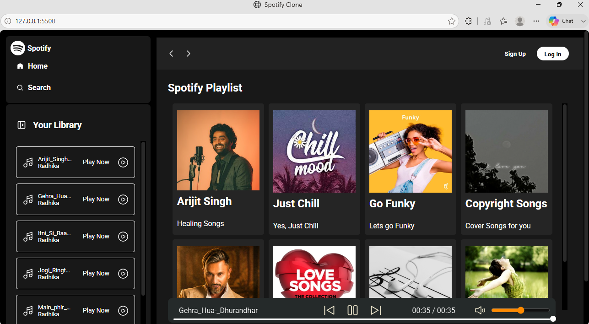

# 🎧 Spotify Clone

> A modern Spotify-inspired music player built with **HTML, CSS, and JavaScript**, featuring dynamic album loading, responsive design, and an interactive music player.

---

## ✨ Overview

This project recreates the core experience of Spotify's web player using only frontend technologies.

Instead of hardcoding albums and songs, the application automatically reads album folders, loads their metadata, and displays them dynamically. Selecting an album instantly updates the music library and starts playback, creating a seamless listening experience.

---

## 🌟 Highlights

* 🎵 Dynamic Album Loading
* 📂 Automatic Song Detection
* ▶️ Play / Pause Music
* ⏮ Previous & ⏭ Next Navigation
* 🎚 Interactive Seekbar
* 🔊 Volume & Mute Controls
* ⏱ Live Song Timer
* 📱 Responsive Layout
* 🍔 Mobile Sidebar Navigation
* 🎨 Spotify-inspired User Interface
* ⚡ Pure Vanilla JavaScript (No Frameworks)

---

## 🛠 Tech Stack

| Technology       | Purpose                     |
| ---------------- | --------------------------- |
| HTML5            | Structure                   |
| CSS3             | Styling & Responsive Design |
| JavaScript (ES6) | Dynamic Functionality       |

---

## 📁 Project Structure

```text
Spotify-Clone
│
├── index.html
├── style.css
├── utility.css
├── javaScript.js
│
├── img/
│
└── songs/
    ├── arijit_singh/
    │     ├── cover.jpg
    │     ├── info.json
    │     └── *.mp3
    │
    ├── chillsong/
    ├── favsongs/
    └── copyright/
```

---

## ⚙️ How It Works

```
Albums Folder
      │
      ▼
Read Album Directories
      │
      ▼
Fetch info.json
      │
      ▼
Generate Album Cards
      │
      ▼
Click Album
      │
      ▼
Load Songs
      │
      ▼
Play Music 🎵
```

---

## 🚀 Features in Action

✔ Dynamic Album Cards

✔ Album Cover Images

✔ Automatic Song Library

✔ Responsive Music Player

✔ Seekbar Navigation

✔ Previous / Next Controls

✔ Live Duration Updates

✔ Volume Control

✔ Mobile-Friendly Sidebar

---

## 📸 Preview

> Add screenshots here after uploading them.

```
Home Screen


Mobile View

```

---

## 💡 Future Improvements

* 🔀 Shuffle Mode
* 🔁 Repeat Mode
* ❤️ Favorite Songs
* 🔍 Search Music
* 🎼 Display Song Artist
* 📃 Playlist Support
* 🌙 Dark / Light Theme
* 🎤 Lyrics Support

---

## 📚 What I Learned

During this project I learned:

* DOM Manipulation
* Async / Await
* Fetch API
* Event Handling
* Audio API
* Responsive Web Design
* Dynamic Rendering
* JavaScript Project Structure

---

## 👩‍💻 Developed By

**Radhika Singh**

B.Tech Student • Frontend Developer • Passionate about Web Development & Problem Solving

---

## ⭐ If you like this project

Give this repository a ⭐ and feel free to fork it for learning purposes.
